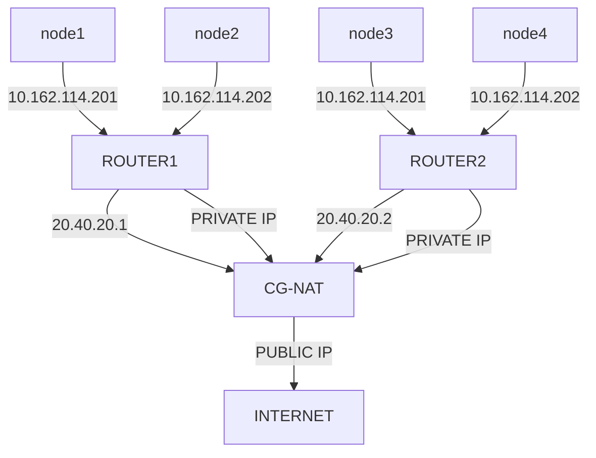
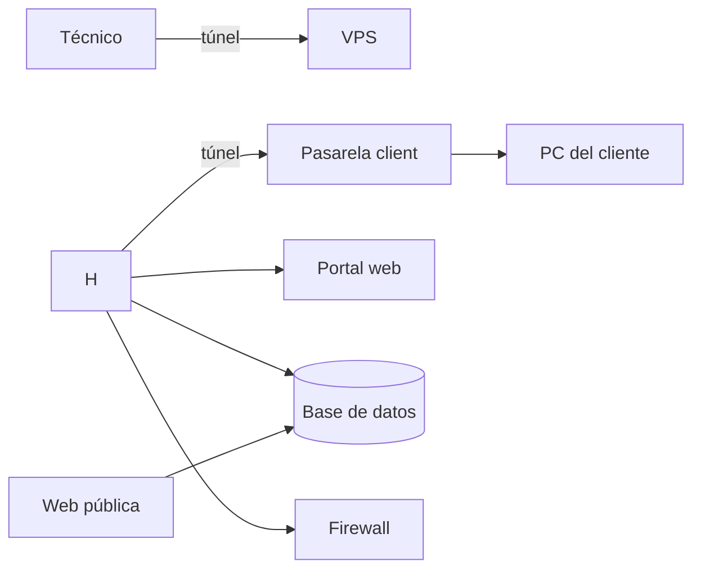

# Esborrany sobre el Projecte
### Context del projecte
Es creara una eina per poder fer monitoratge d'equips que estiguin debaix de un CG-NAT, es resoldra el problema de que els CG-NAT
no tenen cap manera tradicional per poder tenir ports oberts per a serveis o shells disponibles en xarxa que siguin disponibles desde 
una xarxa publica diferent, ja que té una forma de xarxa llogica d'aquesta manera.

### Abast del projecte
Es tindra en compte en la creació del projecte, els usuaris que neccesiten el servei de monitoratge (els clients), la forma de la xarxa de forma llogica, s'intentara possar en practica, el servidor privat en xarxa per poder establir la xarxa, els dispositius raspberry per  

### Diagrama de Projecte

Els agents en el projecte son els següents: 

1. Xarxa
 * Técnic - Amb el seu portatil es podrá connectar en el VPS. 
 * WireGuard pel admin - És el tunel del tecnic fins al VPS. 
 * WireGuard pel client - És el tunel que tindra cada client. 
 * FireWall -  Per tindre un minim de seguretat en la connexió, per només permetre la connexió a autoritzats.
 * Pasarela - Será la Raspberry en casa del client.
 * PC del client - On rebra l'accés.
 * VPS -  El servidor privat que tindrem, on resideix, WireGuard (els tunels), firewall, la base de dades, el reconciliador de peticions de la web amb la bdd, i possiblement la monitorització de connexions, memories...
 > S'utilitzara el VPS de forma simulada, també hauria d'estar el portal web per les peticions del reconciliador per la base de dades, es simulara tota l'estructura funcional pero no per llimitacions de hardware.

2. Gestió
 * Portal web - On el tecnic demana les sessions.
 * Base de dades - On es guarden els clients, sessions...
 * Reconciliador - Compara el que te la bdd amb el que tenim possat.
 > S'esta pensat utilitzar python de forma molt bàsica per crear el reconciliador.
 * Monitorització - Avisa si algun node falla.

3. Serveis
 * Web publica - Presenta el servei del tecnic.

