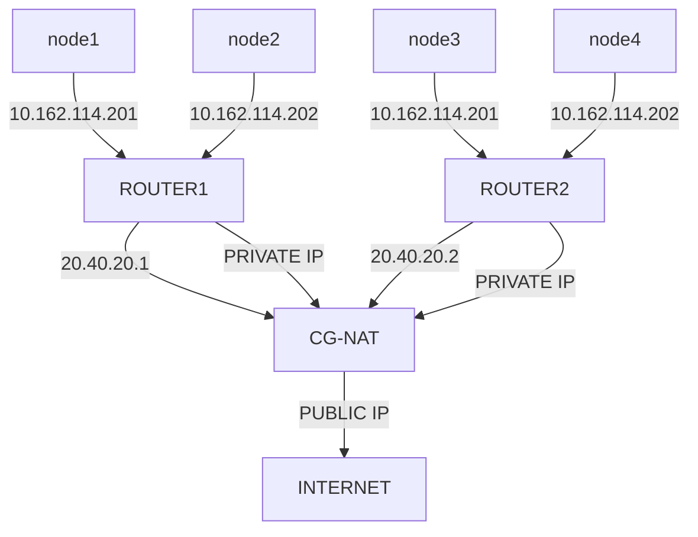
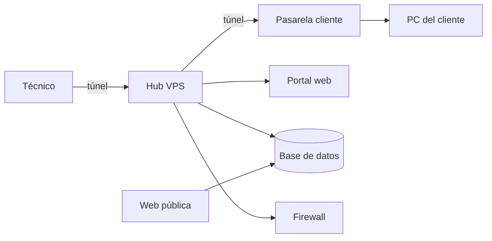

# Esborrany sobre el Projecte
### Context del projecte
Es creara una eina per poder fer monitoratge d'equips que estiguin debaix de un CG-NAT, es resoldra el problema de que els CG-NAT
no tenen cap manera tradicional per poder tenir ports oberts per a serveis o shells disponibles en xarxa que siguin disponibles desde 
una xarxa publica diferent, ja que té una forma de xarxa llogica d'aquesta manera.

### Abast del projecte
Es tindra en compte en la creació del projecte, els usuaris que neccesiten el servei de monitoratge (els clients), la forma de la xarxa de forma llogica, s'intentara possar en practica, el servidor privat en xarxa per poder establir la xarxa, els dispositius raspberry per  

### Diagrama de Projecte

